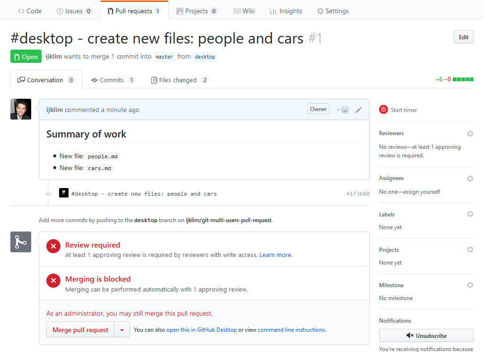
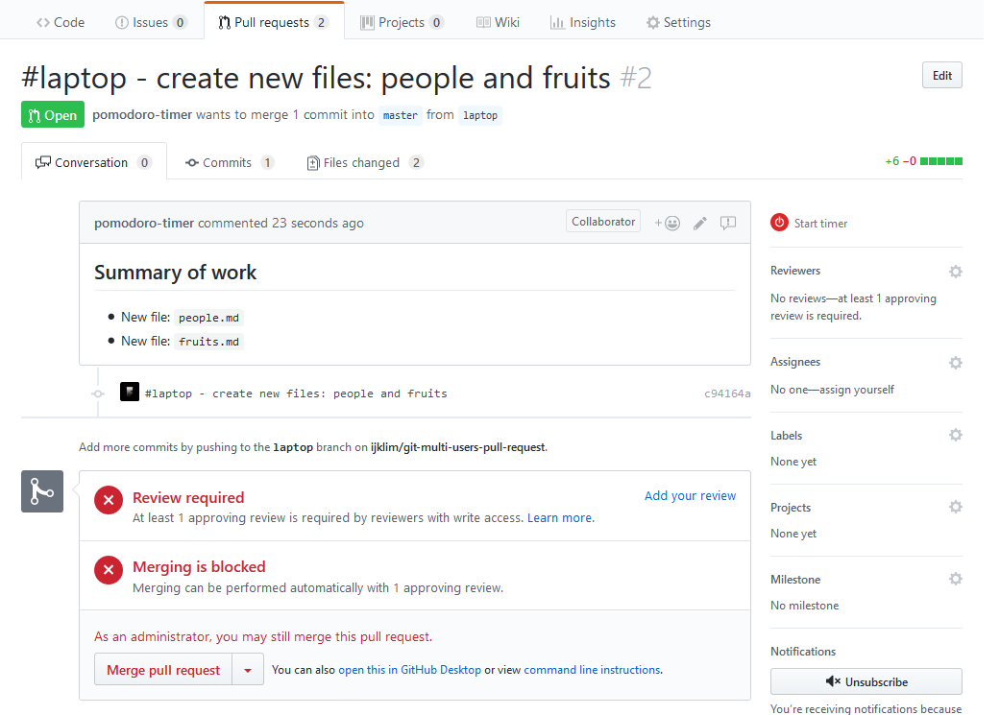
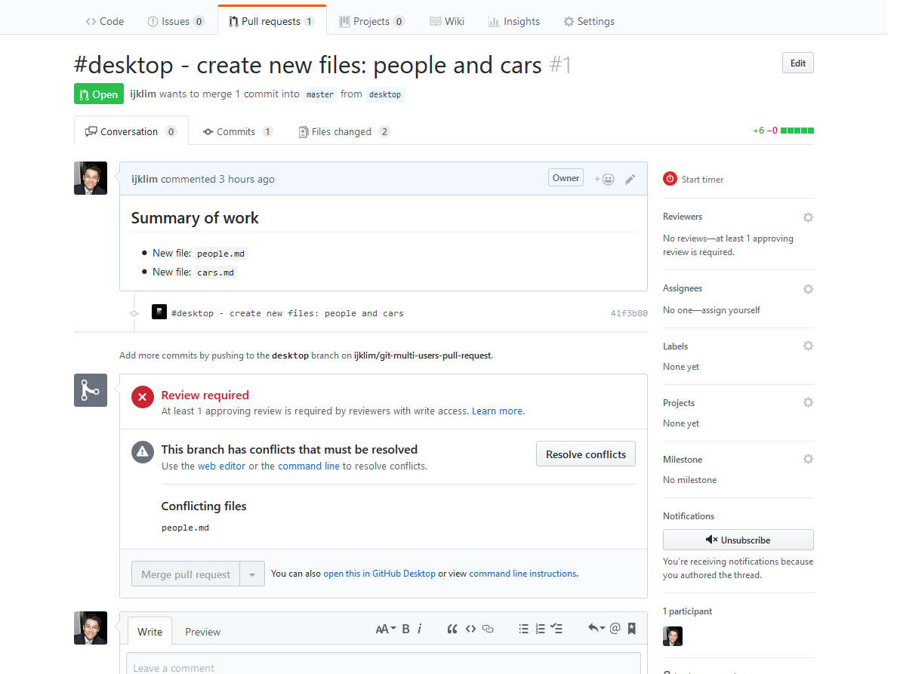

# Project to test git flow with multiple users

## Setup
* Users: *desktop*, *laptop*
* Branches: `master`, `desktop`, `laptop`

### Step 1
* *desktop* create README.md file and create first commit: 'Initial Commit'
* *desktop* push to master

  `git push --set-upstream origin master`

* This should be the first and last time commit is directly pushed to branch `origin/master`
* Protect branch `master` by enabling 'Require pull request reviews before merging'
* Add *laptop* user as Collaborator
* Create and switch to branch `desktop`

  `git checkout -b desktop`

* Create 2 files with 3 lines each: `people.md`, `cars.md`
* Commit the 2 files as '#desktop - create new files: people and cars'
* Push to origin

  `git push --set-upstream origin desktop`

* Create pull request '#desktop - create new files: people and cars'




### Step 2
* *laptop* accept collaborator invitation
* Clone remote repo

  `git clone git@github.com:ijklim/git-multi-users-pull-request.git`

* Create and switch to branch `laptop`

  `git checkout -b laptop`

* Create 2 files with 3 lines each: `people.md`, `fruits.md`
* Commit the 2 files as '#laptop - create new files: people and fruits'
* Push to origin

  `git push --set-upstream origin laptop`

* Create pull request '#laptop - create new files: people and fruits'



### Step 3
* *desktop* approves pull-request from *laptop* '#laptop - create new files: people and fruits'
* *desktop* merge pull-request into branch `master`
* Status of pull-request '#desktop - create new files: people and cars' changes



* Commit screenshots and README.md changes to branch `desktop` as '#desktop - add screenshots and update README'
* Switch to `master`, pull from remote origin

  `git checkout master`
  `git pull`

  Result:
  ```
  Updating 2471afd..6e0febc
  Fast-forward
  fruits.md | 3 +++
  people.md | 3 +++
  2 files changed, 6 insertions(+)
  create mode 100644 fruits.md
  create mode 100644 people.md
  ```

  `git log --oneline`

  Result:
  ```
  6e0febc (HEAD -> master, origin/master) Merge pull request #2 from ijklim/laptop
  c94164a (origin/laptop) #laptop - create new files: people and fruits
  2471afd Initial commit
  ```

* Switch back to `desktop` and attempt to pull changes from local `master`

  `git checkout desktop`
  `git log --oneline`
  
  Result:
  ```
  a4d8c19 (HEAD -> desktop) #desktop - add screenshots and update README
  41f3b80 (origin/desktop) #desktop - create new files: people and cars
  2471afd Initial commit
  ```

  `git merge master`

  Result:
  ```
  Auto-merging people.md
  CONFLICT (add/add): Merge conflict in people.md
  Automatic merge failed; fix conflicts and then commit the result.
  ```

* With merge conflict, cancel merge and use rebase instead

  `git merge --abort`
  `git merge rebase master`
  
  Result:
  ```
  First, rewinding head to replay your work on top of it...
  Applying: #desktop - create new files: people and cars
  error: Failed to merge in the changes.
  Using index info to reconstruct a base tree...
  Falling back to patching base and 3-way merge...
  Auto-merging people.md
  CONFLICT (add/add): Merge conflict in people.md
  Patch failed at 0001 #desktop - create new files: people and cars
  The copy of the patch that failed is found in: .git/rebase-apply/patch

  Resolve all conflicts manually, mark them as resolved with
  "git add/rm <conflicted_files>", then run "git rebase --continue".
  You can instead skip this commit: run "git rebase --skip".
  To abort and get back to the state before "git rebase", run "git rebase --abort".
  ```

* Fix conflict in file `people.md` and continue

  `git add people.md`
  `git rebase --continue`

* Push to remote `desktop`

  `git push`
